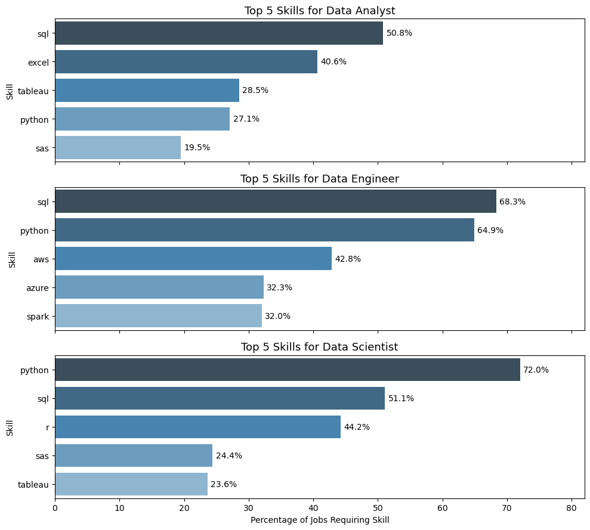

# The Analysis

Each Jupyter notebook for this project aimed at investigating specific aspects of the data job market. Here’s how I approached each question:

## 1. What are the most demanded skills for the top 3 most popular data roles?

To find the most demanded skills for the top 3 most popular data roles. I filtered out those positions by which ones were the most popular, and got the top 5 skills for these top 3 roles. This query highlights the most popular job titles and their top skills, showing which skills I should pay attention to depending on the role I'm targeting. 

View my notebook with detailed steps here: [2_Skill_Count](3_Project/2_Skills_Count.ipynb).

### Visualize Data

```python
# Plot the horizontal bar charts
fig, axes = plt.subplots(3, 1, figsize=(10, 9), sharex=True)

# Define a function to plot each bar chart
def plot_skills(ax, skills, title):
    # Convert Series to DataFrame
    df = skills.reset_index()
    df.columns = ['skill', 'percent']

    # Plot with seaborn
    palette = sns.color_palette("Blues_d", len(df))[::-1]  # Reverse the colors
    sns.barplot(data=df, y='skill', x='percent', ax=ax, palette=palette)
    # Add labels on bars
    for i, v in enumerate(df['percent']):
        ax.text(v + 0.5, i, f'{v}%', va='center', fontsize=10)

    # Titles and labels
    ax.set_title(title, fontsize=13)
    ax.set_xlabel('Percentage of Jobs Requiring Skill')
    ax.set_ylabel('Skill')
    ax.set_xlim(0, df['percent'].max() + 10)  # Extra space for label text

# Plot for each job title
plot_skills(axes[0], data_analyst_skills, 'Top 5 Skills for Data Analyst')
plot_skills(axes[1], data_engineer_skills, 'Top 5 Skills for Data Engineer')
plot_skills(axes[2], data_scientist_skills, 'Top 5 Skills for Data Scientist')

plt.tight_layout()
plt.show()
```

### Results



*Bar graph visualizing the salary for the top 3 data roles and their top 5 skills associated with each.*

### Insights:

- SQL is the most requested skill for Data Analysts and Data Scientists, with it in over half the job postings for both roles. For Data Engineers, Python is the most sought-after skill, appearing in 68% of job postings.
- Data Engineers require more specialized technical skills (AWS, Azure, Spark) compared to Data Analysts and Data Scientists who are expected to be proficient in more general data management and analysis tools (Excel, Tableau).
- Python is a versatile skill, highly demanded across all three roles, but most prominently for Data Scientists (72%) and Data Engineers (65%).